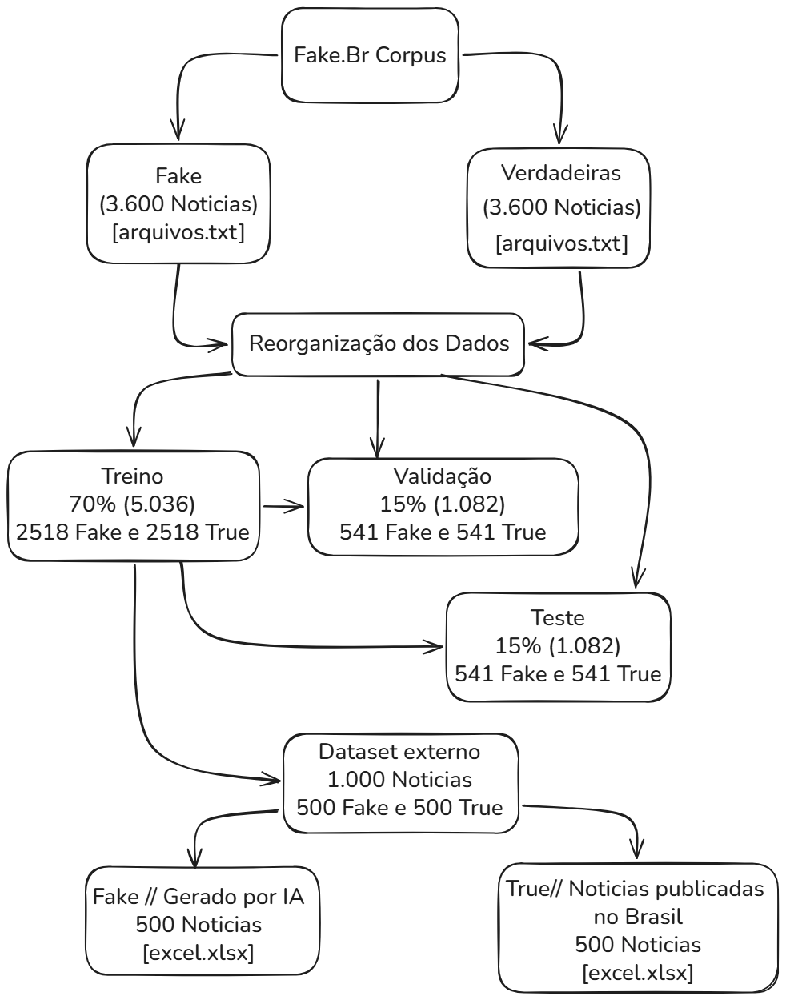

# Fake News Detection using Machine Learning

<p align="center">
  
  
  
  
  
</p>

---


This repository contains the implementation developed for my **Bachelor's Thesis in Computer Science**, whose objective was to **compare the performance of two classical Machine Learning algorithms** in the task of detecting fake news written in Brazilian Portuguese.

The study evaluates two supervised learning models:

- Random Forest
- Support Vector Machine (Linear SVM)

Both algorithms were trained and evaluated under identical experimental conditions, allowing a fair comparison between their performance, robustness, and generalization capability.

Unlike many works that only report accuracy values, this project also investigates the internal behavior of both algorithms, including:

- Decision tree analysis;
- Feature importance;
- SVM hyperplane;
- Weight vector;
- Most influential words;
- Generalization using an external dataset.

---

# Objectives

The main objectives of this research were:

- Compare Random Forest and Support Vector Machine for fake news detection;
- Evaluate the behavior of both algorithms during training;
- Analyze their performance on validation and testing datasets;
- Evaluate model generalization using external news;
- Investigate the interpretability of both models.

---

# Machine Learning Models

## Random Forest

Random Forest is an ensemble learning algorithm composed of multiple Decision Trees.

Characteristics:

- 300 Decision Trees
- Gini Criterion
- Bootstrap Sampling
- OOB Score
- Feature Importance Analysis

---

## Support Vector Machine

The Support Vector Machine (LinearSVC) learns a hyperplane capable of separating fake and legitimate news within the TF-IDF feature space.

The implementation also extracts:

- Hyperplane
- Weight vector
- Most influential terms
- Documents closest to the decision boundary

---

# Dataset

This project uses the **Fake.Br Corpus**, one of the most important datasets for fake news detection in Brazilian Portuguese.

> **The Fake.Br Corpus is NOT included in this repository.**

The dataset is distributed separately by its authors and must be obtained directly from the official publication.

If you use this project, **please cite the Fake.Br Corpus paper.**

Reference:

> MONTEIRO, Rafael A. et al.  
> **Fake.Br Corpus: A Corpus of Fake News for Brazilian Portuguese.**  
> Proceedings of WebMedia, 2018.

---

## Dataset organization



---

# Pre-processing

The following preprocessing steps were applied:

- Text normalization
- TF-IDF vectorization
- Maximum vocabulary: **30,000 features**

---

# Experimental Methodology

The experiments followed the same pipeline for both algorithms.

```
Fake.Br Corpus
        │
        ▼
 Pre-processing
        │
        ▼
 TF-IDF Vectorization
        │
 ┌──────┴────────┐
 ▼               ▼
Random Forest    Linear SVM
 ▼               ▼
Validation
 ▼
Testing
 ▼
External Testing
 ▼
Performance Comparison
```

---

# Dataset Split

| Dataset | Percentage |
|----------|-----------:|
| Training | 70% |
| Validation | 15% |
| Testing | 15% |

---

# External Test

To evaluate model generalization, an additional experiment was performed using:

- **499 real news articles**
- **499 synthetic fake news generated by Artificial Intelligence**

The real news came from:

**Notícias Publicadas no Brasil**
https://www.kaggle.com/datasets/diogocaliman/notcias-publicadas-no-brasil

---

# Evaluation Metrics

The following metrics were used:

- Accuracy
- Precision
- Recall
- F1-score
- ROC Curve
- AUC
- Confusion Matrix

---

# Generated Reports

The project automatically generates:

## Random Forest

- Training report
- Validation report
- Testing report
- External testing report
- Confusion Matrix
- ROC Curve
- Tree statistics
- Feature Importance

---

## Support Vector Machine

- Training report
- Validation report
- Testing report
- External testing report
- Hyperplane
- Weight Vector
- Most Important Words
- Documents closest to the Hyperplane
- Confusion Matrix
- ROC Curve


---

# References

If you use this repository in academic work, please cite:

### Fake.Br Corpus

```
MONTEIRO, Rafael A. et al.
Fake.Br Corpus: A Corpus of Fake News for Brazilian Portuguese.
Proceedings of WebMedia.
```

---


